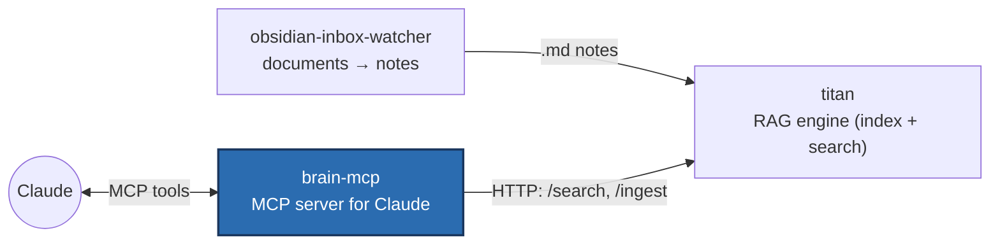

# brain-mcp

**An MCP server that connects a local RAG backend to Claude as an authenticated
custom connector — plus a vault watcher that keeps an Obsidian vault searchable
automatically.**

Through the [Model Context Protocol](https://modelcontextprotocol.io) (MCP),
Claude can call external tools. brain-mcp exposes six such tools and answers them
from **[titan](https://github.com/charlieLucke/titan)** — the local RAG system
(separate repo) that does the actual semantic search over the vault.

## What it does



brain-mcp consists of two services:

- **brain-watcher** — watches the Obsidian vault, detects changed notes (with a
  30-second debounce + reconnect logic) and forwards them to titan for
  re-indexing. The search index stays current with no manual step.
- **brain-mcp** — the MCP server itself, offering Claude the tools below.

### MCP tools (the externally visible functionality)

| Tool | Purpose |
|---|---|
| `query_knowledge` | Search the vault in natural language (optional `domain` filter, `top_k`). |
| `find_related` | Find notes semantically related to a given note. |
| `list_domains` | List all knowledge areas (domains) in the index with their chunk counts. |
| `list_notes` | List every indexed note, with domain + chunk count. |
| `ingest_note` | Re-index a note immediately, bypassing the watcher's delay. |
| `delete_note` | De-index a note (removes only its chunks; the file on disk stays). |

## Deployment & security (the technically interesting part)

Claude connects *custom connectors* server-side from the Anthropic cloud — so the
endpoint must be **publicly reachable over HTTPS and authenticated**. The solution
combines several pieces that together demonstrate realistic, secured self-hosting:

- **Tailscale Funnel** exposes the locally-running service under a public HTTPS
  hostname without opening router ports.
- **GitHub OAuth proxy with a login allowlist** (`src/brain_mcp/auth.py`): every
  request is authenticated via OAuth, and only explicitly allowed GitHub accounts
  get through — everyone else is rejected with a 401 at the auth layer.
- **WSL2 networking detail:** the server deliberately binds `0.0.0.0` instead of
  `127.0.0.1`, because under WSL2 mirrored networking a loopback-only service is
  unreachable from the Windows-side Funnel (otherwise 502). Access stays protected
  by OAuth.
- Runs as **systemd user services** with linger enabled, so the services keep
  running independently of an open login session.

Full step-by-step guide: **[`deploy/README.md`](deploy/README.md)**.

## Part of a larger system

- **[obsidian-inbox-watcher](https://github.com/charlieLucke/obsidian-inbox-watcher)** —
  turns dropped PDFs/DOCX/URLs into structured notes with an LLM.
- **[titan](https://github.com/charlieLucke/titan)** — the RAG engine (indexing +
  hybrid search over Qdrant).
- **brain-mcp** *(you are here)* — connects titan to Claude over MCP.

## Transport modes

- **stdio** (default, simplest) — an MCP client launches brain-mcp as a subprocess.
  No network exposure, no auth. Best for local use.
- **HTTP** (the deployed mode) — a long-lived server for a Claude custom connector
  (see above).

## Prerequisites

- **Python 3.12+** and **[uv](https://docs.astral.sh/uv/)**.
- **A running titan service** (the RAG backend). brain-mcp talks to it over HTTP
  at `BRAIN_TITAN_URL` (default `http://127.0.0.1:8765`); without it the tools
  return "Titan unreachable".

> **Placeholders:** values like `<your-user>`, `<your-tailnet-host>.ts.net` and
> `<your-github-login>` are examples from the author's setup — replace with your own.

## Development

Requires [uv](https://docs.astral.sh/uv/) and Python 3.12+.

```bash
make install    # install dependencies + pre-commit hooks
make run        # run the server locally (python -m brain_mcp)
make test       # run tests with coverage
make check      # full quality gate: lint + types + tests
make format     # auto-fix style issues
make help       # list all available commands
```

## Project Structure

```
src/brain_mcp/
├── config.py        # Settings (env prefix BRAIN_)
├── schemas.py       # Pydantic schemas (local copy of the titan API schemas)
├── titan_client.py  # HTTP client for titan (httpx, retry via tenacity)
├── mcp_server.py    # FastMCP server + the six tools
├── auth.py          # GitHub OAuth proxy with a login allowlist
├── read_api.py      # read-only HTTP side (/api/vault/*), token-gated
└── watcher.py       # VaultWatcher (watchdog, debounce, reconnect)
deploy/              # systemd services + activation/connector guide
tests/               # Pytest tests (mirrors src/ layout)
docs/ai/             # architecture, decisions and plans
```

## Tooling

| Tool         | Purpose                              |
|--------------|--------------------------------------|
| **uv**       | Package manager + Python installer   |
| **ruff**     | Linter + formatter                   |
| **mypy**     | Static type checker (strict mode)    |
| **pytest**   | Test runner with coverage            |
| **pre-commit** | Git hook runner                    |

All tools run in CI on every push.

## Documentation & developer workflow

In-depth architecture and design decisions live in [`docs/ai/`](docs/ai/). These
files also drive a structured AI-assisted development workflow; `CLAUDE.md`
(mirrored as `AGENTS.md`/`GEMINI.md`) is the entry point for any agent.

🇩🇪 Eine deutsche Fassung dieser README gibt es unter [README.de.md](README.de.md).

## License

MIT — see [LICENSE](LICENSE).
