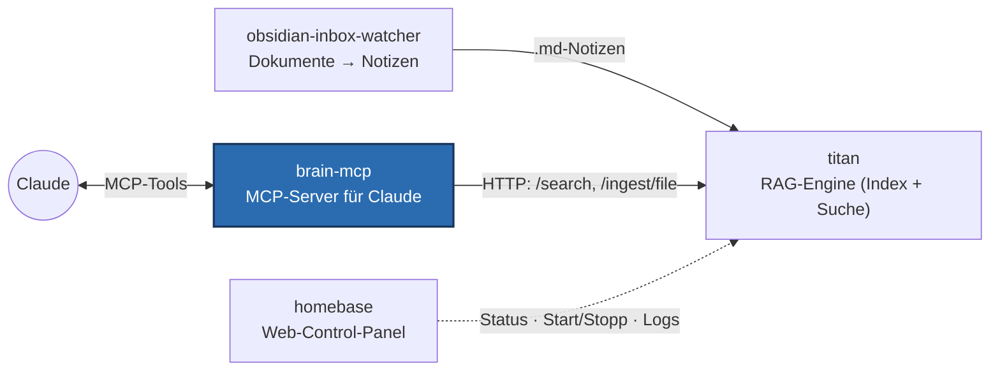

# brain-mcp

**Ein MCP-Server, der ein lokales RAG-Backend als authentifizierten Custom
Connector an Claude anbindet — plus ein Vault-Watcher, der einen Obsidian-Vault
automatisch durchsuchbar hält.**

Über das [Model Context Protocol](https://modelcontextprotocol.io) (MCP) kann
Claude externe Werkzeuge aufrufen. brain-mcp stellt zwölf solcher Werkzeuge bereit
und beantwortet sie aus
**[titan](https://github.com/charlieLucke/titan)** — dem lokalen RAG-System
(separates Repo), das die eigentliche semantische Suche über den Vault übernimmt.

## Was es macht



brain-mcp besteht aus zwei Diensten:

- **brain-watcher** — überwacht den Obsidian-Vault, erkennt geänderte Notizen
  (mit 30-Sekunden-Debounce + Reconnect-Logik) und reicht sie an titan zur
  Neuindexierung weiter. So bleibt der Suchindex ohne manuelles Zutun aktuell.
- **brain-mcp** — der MCP-Server selbst, der Claude die folgenden Werkzeuge anbietet.

### MCP-Werkzeuge (die nach außen sichtbare Funktionalität)

| Werkzeug | Zweck |
|---|---|
| `query_knowledge` | Den Vault in natürlicher Sprache durchsuchen (optionaler `domain`-Filter, `top_k`). |
| `find_related` | Notizen finden, die einer gegebenen Notiz semantisch verwandt sind. |
| `list_domains` | Alle Wissensbereiche (Domains) im Index mit ihrer Chunk-Anzahl auflisten. |
| `list_notes` | Jede indexierte Notiz auflisten, mit Domain + Chunk-Anzahl. |
| `ingest_note` | Eine Notiz sofort neu indexieren, unter Umgehung der Watcher-Verzögerung. |
| `delete_note` | Eine Notiz de-indexieren (entfernt nur ihre Chunks; die Datei auf der Platte bleibt). |

Die sechs oben lesen und indexieren. Die folgenden sechs schreiben in den Vault
selbst — sie sind der Grund, warum der HTTP-Modus eine Allowlist braucht und nicht
bloß eine Anmeldung:

| Werkzeug | Zweck |
|---|---|
| `vault_style` | Die Hausform für Notizen in diesem Vault. Vor jedem Schreiben oder Ändern aufzurufen. |
| `write_note` | Eine **neue** Notiz anlegen. Schlägt fehl, wenn die Datei schon existiert. |
| `edit_note` | Eine exakte Passage in einer bestehenden Notiz ersetzen — mit `content_hash`, damit nicht auf einen Stand geschrieben wird, den jemand inzwischen geändert hat. |
| `append_section` | Einen Abschnitt an eine bestehende Notiz anhängen. |
| `mark_verified` | Festhalten, dass die Aussagen einer Notiz heute gegen die Wirklichkeit geprüft wurden. |
| `list_stale` | Notizen finden, deren Aussagen womöglich nicht mehr stimmen (nach Alter, optional je Domain). |

## Deployment & Sicherheit (das technisch Interessante)

Claude verbindet *Custom Connectors* serverseitig aus der Anthropic-Cloud — der
Endpunkt muss also **öffentlich über HTTPS erreichbar und authentifiziert** sein.
Die Lösung kombiniert mehrere Bausteine, die zusammen ein realistisches,
abgesichertes Self-Hosting demonstrieren:

- **Tailscale Funnel** stellt den lokal laufenden Dienst unter einem öffentlichen
  HTTPS-Hostnamen bereit, ohne Ports im Router zu öffnen.
- **GitHub-OAuth-Proxy mit Login-Allowlist** (`src/brain_mcp/auth.py`): Jeder
  Request wird über OAuth authentifiziert, und nur explizit erlaubte GitHub-Konten
  kommen durch — alle anderen werden bereits auf der Auth-Ebene mit 401 abgewiesen.
- **WSL2-Netzwerk-Detail:** Der Server bindet bewusst an `0.0.0.0` statt
  `127.0.0.1`, weil ein reiner Loopback-Dienst unter WSL2 Mirrored Networking von
  der Windows-seitigen Funnel aus unerreichbar ist (sonst 502). Der Zugriff bleibt
  durch OAuth geschützt.
- Betrieb als **systemd-User-Services** mit aktivem Linger, sodass die Dienste
  unabhängig von einer offenen Login-Sitzung weiterlaufen.

Vollständige Schritt-für-Schritt-Anleitung: **[`deploy/README.md`](deploy/README.md)**.

## Teil eines größeren Systems

- **[obsidian-inbox-watcher](https://github.com/charlieLucke/obsidian-inbox-watcher)** —
  verwandelt eingeworfene PDFs/DOCX/URLs mit einem LLM in strukturierte Notizen.
- **[titan](https://github.com/charlieLucke/titan)** — die RAG-Engine
  (Indexierung + hybride Suche über Qdrant).
- **brain-mcp** *(du bist hier)* — bindet titan über MCP an Claude an.
- **[homebase](https://github.com/charlieLucke/homebase)** — das Web-Control-Panel:
  Status, Logs und Start/Stopp der Dienste. Steht daneben, nicht im Datenpfad.

## Transport-Modi

- **stdio** (Default, am einfachsten) — ein MCP-Client startet brain-mcp als
  Subprozess. Keine Netzwerk-Exposition, keine Auth. Ideal für lokale Nutzung.
- **HTTP** (der deployte Modus) — ein langlebiger Server für einen Claude-Custom-Connector
  (siehe oben).

## Voraussetzungen

- **Python 3.12+** und **[uv](https://docs.astral.sh/uv/)**.
- **Ein laufender titan-Service** (das RAG-Backend). brain-mcp spricht über HTTP
  mit ihm unter `BRAIN_TITAN_URL` (Default `http://127.0.0.1:8765`); ohne ihn liefern
  die Tools „Titan unreachable".

> **Platzhalter:** Werte wie `<your-user>`, `<your-tailnet-host>.ts.net` und
> `<your-github-login>` sind Beispiele aus dem Setup des Autors — durch eigene ersetzen.

## Entwicklung

Erfordert [uv](https://docs.astral.sh/uv/) und Python 3.12+.

```bash
make install    # Abhängigkeiten + pre-commit-Hooks installieren
make run        # den Server lokal ausführen (python -m brain_mcp)
make test       # Tests mit Coverage ausführen
make check      # vollständiges Quality-Gate: Lint + Typen + Tests
make format     # Style-Probleme automatisch beheben
make help       # alle verfügbaren Befehle auflisten
```

## Projektstruktur

```
src/brain_mcp/
├── config.py        # Settings (Env-Präfix BRAIN_)
├── schemas.py       # Pydantic-Schemas (lokale Kopie der titan-API-Schemas)
├── titan_client.py  # HTTP-Client für titan (httpx, Retry via tenacity)
├── mcp_server.py    # FastMCP-Server + die sechs Tools
├── auth.py          # GitHub-OAuth-Proxy mit Login-Allowlist
├── read_api.py      # lesende HTTP-Seite (/api/vault/*), per Token gesichert
└── watcher.py       # VaultWatcher (watchdog, Debounce, Reconnect)
deploy/              # systemd-Services + Aktivierungs-/Connector-Anleitung
tests/               # Pytest-Tests (spiegelt das src/-Layout)
docs/ai/             # Architektur, Entscheidungen und Pläne
```

## Tooling

| Tool         | Zweck                                |
|--------------|--------------------------------------|
| **uv**       | Paketmanager + Python-Installer      |
| **ruff**     | Linter + Formatter                   |
| **mypy**     | Statischer Typprüfer (Strict Mode)   |
| **pytest**   | Test-Runner mit Coverage             |
| **pre-commit** | Git-Hook-Runner                    |

Alle Tools laufen bei jedem Push in der CI.

## Dokumentation & Entwickler-Workflow

Vertiefende Architektur- und Designentscheidungen liegen in
[`docs/ai/`](docs/ai/). Diese Dateien dienen zugleich einem strukturierten
KI-gestützten Entwicklungsworkflow; `CLAUDE.md` (gespiegelt als
`AGENTS.md`/`GEMINI.md`) ist der Einstiegspunkt für jeden Agenten.


## Lizenz

MIT — siehe [LICENSE](LICENSE).
